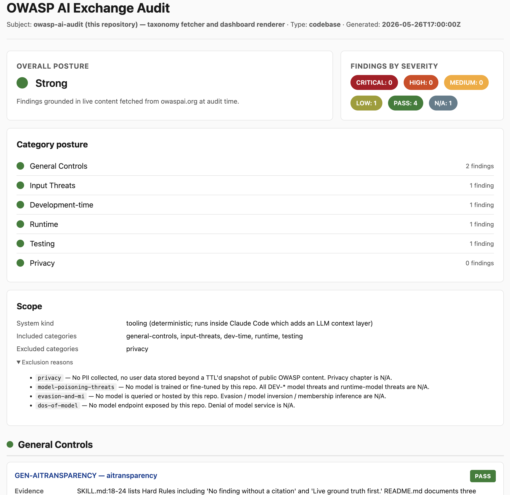

# owasp-ai-audit

> A Claude Code skill that audits AI systems against the [OWASP AI Exchange](https://owaspai.org/) threat taxonomy. Grounded in live content. Cites every finding. Produces a self-contained HTML dashboard that prints to PDF.

## What this is

A drop-in skill folder for [Claude Code](https://claude.ai/code). Point Claude at a codebase or paste an architecture description, ask for an OWASP AI audit, and get back:

- A traffic-light dashboard across the six OWASP AI Exchange categories
- Per-finding verdicts (`CRITICAL` / `HIGH` / `MEDIUM` / `LOW` / `PASS` / `N/A`) with concrete evidence and reasoning
- Every threat reference linked to its `owaspai.org/go/{slug}/` permalink
- Recommended controls, also citing OWASP permalinks
- A printable, self-contained HTML report — no servers, no external assets



*The screenshot above is the actual dashboard the skill produced when run on its own repository — every category green, one bug found and fixed (see [v0.2.0 → v0.2.1](https://github.com/aydinfer/owasp-ai-audit/releases)).*

## Why grounding matters

LLMs hallucinate threat categories, invent CVE numbers, and confidently mis-cite OWASP. This skill refuses to. Every finding cites a real permalink on owaspai.org. If the source can't be fetched and isn't in the bundled snapshot, the finding doesn't ship.

## How this differs from Claude Code's `/security-review`

Claude Code already ships with a `/security-review` skill. It's good. This skill does something different. Run both.

|                       | **`/security-review`** (built-in)                                  | **`owasp-ai-audit`** (this skill)                                                                       |
| --------------------- | ------------------------------------------------------------------ | ------------------------------------------------------------------------------------------------------- |
| **Scope**             | Pending diff on the current branch                                 | The whole AI system — codebase or architecture description                                              |
| **Threat surface**    | General app sec: SQLi, XSS, secrets, auth, OWASP Web Top 10        | AI-specific: prompt injection, RAG poisoning, model theft, training-data leak, agent over-privilege, alignment, etc. |
| **Source of truth**   | Claude's general knowledge of security patterns                    | The OWASP AI Exchange taxonomy — every finding cites a `/go/{slug}/` permalink                          |
| **When to run**       | Before merging a PR                                                | Before shipping an AI feature, or auditing one that's already live                                      |
| **Output**            | Prose review in chat                                               | `findings.json` + a self-contained `dashboard.html` (print-to-PDF for sharing)                          |
| **Will catch**        | "You're concatenating SQL strings at `db.py:42`"                   | "Your RAG retrieves from a user-editable KB without provenance — that's indirect prompt injection"      |
| **Will miss**         | The RAG-injection thing above                                      | The SQL concat thing                                                                                    |

They're complementary by design. `/security-review` won't flag prompt injection — it's not a Web Top-10 concern. `owasp-ai-audit` won't flag a credential in `.env` — that's not an AI threat. The honest workflow on a serious AI system: run both, treat the outputs as a union, fix everything.

## Does it audit, or does it also fix?

It audits and **recommends grounded controls**. It does *not* write patches.

Every finding includes a `recommended_controls` list. Each control is itself an OWASP-cited permalink with a short summary of what to do — e.g. for indirect prompt injection, the recommendation cites [`/go/promptinjectionsevenlayers/`](https://owaspai.org/go/promptinjectionsevenlayers/) (the layered defence) and [`/go/inputsegregation/`](https://owaspai.org/go/inputsegregation/) (treat retrieved content as untrusted). You implement; the skill points at the canonical reference.

This is deliberate. Auto-patching a security finding without human review is how you ship false confidence — a "fix" that closes the lint warning but not the actual attack path. The recommendation pattern is: *the skill grades the system, cites the literature, and a human makes the call on the patch* (with Claude Code's normal coding tools, in a follow-up turn, if you want).

If you do want a patch turn after the audit, just ask:

```
Take the HIGH and CRITICAL findings from dashboard.html and propose patches.
```

That's normal Claude Code — the audit happens to give you a structured, cited starting point.

## Use as a CI check

Beyond the interactive skill, this repo ships a **composite GitHub Action** that runs a non-interactive *static first-pass screen* on every PR. Add it to a workflow:

```yaml
# .github/workflows/owasp-ai-audit.yml
name: OWASP AI Audit
on: [pull_request]
permissions:
  contents: read
  pull-requests: write   # only needed for comment-pr
jobs:
  screen:
    runs-on: ubuntu-latest
    steps:
      - uses: actions/checkout@v6
      - uses: aydinfer/owasp-ai-audit@v0.3.0
        with:
          target: .
          fail-on: HIGH        # NONE | LOW | MEDIUM | HIGH | CRITICAL
          comment-pr: true     # post the screen summary as a PR comment
```

What it does, and — importantly — what it does *not* do:

- It statically catalogues the AI surfaces in `target` (LLM call sites, prompt construction, tool/function defs, embedding/RAG calls, rate-limit sites), maps each to the OWASP AI Exchange threats it implicates, and fetches a live `/go/{slug}/` citation for every one.
- It writes a `findings.json` + `dashboard.html` and (on PR events) posts a summary comment.
- **It does not grade severity.** A non-LLM pass can't judge whether input is isolated, output is validated, or a surface is actually exposed — so every finding it writes is `UNKNOWN`. The Action's job is to surface *presence* and *citations*, then point you at the real audit.

Because findings are ungraded, the `fail-on` gate is conservative: an `UNKNOWN` is treated as *"could be anything up to CRITICAL"* and so trips **any** threshold other than `NONE`. Set `fail-on: NONE` (the default) for a report-only screen, or any level to block PRs until a human runs the full [SKILL.md](SKILL.md) workflow in Claude Code. The PR comment it posts looks like:

> ### OWASP AI Audit — static first-pass screen
>
> **Overall posture:** Needs Review  
> **Findings (8):** UNKNOWN: 8
>
> **Top findings**
> - `UNKNOWN` [INPUT-DIRECTPROMPTINJECTION](https://owaspai.org/go/directpromptinjection/) — 4 static surface(s): `app/chat.ts:7` …
> - `UNKNOWN` [RUN-AUGMENTATIONDATALEAK](https://owaspai.org/go/augmentationdataleak/) — `lib/rag.ts:9` …
>
> _First-pass static screen — surfaces presence and citations, not severity. Run the full SKILL.md audit in Claude Code for verdicts._

The Action runs on Node 22 with zero third-party runtime dependencies (Node stdlib + `curl` + `jq`), in keeping with the skill's supply-chain posture.

## Deterministic AI-surface enumerator

Before the audit reasons about anything, it statically catalogues every AI surface in a codebase:

```bash
node scripts/enumerate-ai-surfaces.js path/to/repo --out surfaces.json
```

This parses each TypeScript / TSX / JavaScript / Python / Go file with a vendored tree-sitter grammar and matches **structural queries** — LLM call sites, prompt construction, tool/function definitions, embedding/RAG calls, auth surfaces, rate-limit sites — emitting a `surfaces.json` where each entry carries the file, line range, kind, name, enclosing `callers`, and an evidence excerpt. Because detection runs on the AST and not on raw text, it doesn't trip on strings, comments, or look-alikes (Vitest's `test()`, readline's `prompt`).

Why it matters: the [benchmark run](benchmarks/skill-issues.md) found the real attack surface routinely lived in files too large to read end-to-end (a 5204-line `middleware.py`, an 11806-line `router.py`). Enumerating surfaces first anchors every finding to a detected node instead of to whatever fit in context. Both the GitHub Action and the interactive [SKILL.md](SKILL.md) workflow (Step 1.5) use it; the CI runner falls back to regex detectors only if the vendored runtime can't load.

The tree-sitter runtime and grammar `.wasm` files are vendored, pinned and checksummed under [`scripts/lib/parsers/`](scripts/lib/parsers/) — no `npm install`, no runtime dependency. See that directory's README for versions and provenance.

## Install

```bash
# In your Claude Code skills directory:
git clone https://github.com/aydinfer/owasp-ai-audit.git
```

The skill is auto-discovered by Claude Code when placed in a skills directory.

### Requirements

- `bash` and `curl` (standard on macOS / Linux / WSL)
- `jq` — used by the fetch script for taxonomy lookups
  - macOS: `brew install jq`
  - Debian/Ubuntu: `apt-get install jq`
- `node` 18+ — used by the dashboard renderer
- Network access to `owaspai.org` (or use bundled snapshot)

## Usage

In Claude Code:

```
Audit this repo against OWASP AI Exchange.
```

or

```
Here's our architecture for a RAG-based assistant: [paste description].
Run an OWASP AI audit on it.
```

The skill detects the input type, scopes the audit, fetches threat content (cached or live), produces findings, and renders a dashboard. Open the dashboard in any browser and use **Print → Save as PDF** to share.

## How it works

```
input
  ↓
[detect: codebase | architecture]
  ↓
[load taxonomy-index.json — the map of OWASP AI threats]
  ↓
[scope filter — drop threats irrelevant to system class]
  ↓
[fetch-threat.sh per threat: memory → disk cache → live → snapshot]
  ↓
[Claude analyses, grades per verdict-rules.md, follows Deep Trace on code]
  ↓
[write findings.json]
  ↓
[render-dashboard.js → dashboard.html]
  ↓
[user prints to PDF]
```

## Repo layout

```
owasp-ai-audit/
├── SKILL.md                              # The skill instructions Claude reads
├── action.yml                            # Composite GitHub Action (CI static screen)
├── reference/
│   ├── taxonomy-index.json               # Map of OWASP AI threats + controls + permalinks
│   ├── verdict-rules.md                  # Explicit severity assignment rules
│   └── snapshot/                         # Offline fallback (auto-refreshed weekly)
├── scripts/
│   ├── lib/
│   │   ├── sanitize.js                   # esc(), safeUrl() — used by the renderer
│   │   ├── extract.js                    # htmlToText(), extractSections() — used by the regrounder
│   │   ├── static-detectors.js           # regex AI-surface detectors (CI runner fallback)
│   │   ├── audit-summary.js              # findings.json → Markdown summary (PR comment)
│   │   ├── ai-surface-detectors.js       # language registry for the AST enumerator
│   │   ├── ai-surface-detectors/         # per-language tree-sitter detector sets
│   │   └── parsers/                      # vendored tree-sitter runtime + grammar .wasm
│   ├── fetch-threat.sh                   # Cascaded fetch (memory → cache → live → snapshot)
│   ├── snapshot-update.js                # Refreshes bundled snapshot from owaspai.org
│   ├── reground-applies-to.js            # Re-derives applies_to from live chapter content
│   ├── enumerate-ai-surfaces.js          # Deterministic AST catalogue of AI surfaces → surfaces.json
│   ├── run-audit.js                      # Non-interactive CI runner (static first-pass screen)
│   ├── pr-comment.js                     # Posts the screen summary as a PR comment
│   └── render-dashboard.js               # findings.json → dashboard.html
├── examples/
│   ├── findings.json                     # Sample findings (RAG support assistant)
│   └── dashboard.html                    # Rendered example dashboard
├── tests/                                # Unit tests (node:test, no deps)
└── .github/workflows/
    └── snapshot-refresh.yml              # Weekly snapshot refresh PR
```

## Grounding modes

| Mode | When used | Reported as |
|------|-----------|-------------|
| `live` | Fresh fetch from owaspai.org | Footer note: "Findings grounded in live content fetched from owaspai.org at audit time." |
| `cache` | Disk cache within 7-day TTL (`~/.cache/owasp-ai-audit/`) | Footer note: "...recently cached content from owaspai.org (within 7-day TTL)." |
| `snapshot` | Live fetch failed, falling back to bundled snapshot | Footer note: "Live fetch failed. Findings grounded in bundled snapshot. Refresh snapshot or check connectivity." |

The dashboard always shows which mode was used. No silent degradation.

## Updating the snapshot

The snapshot in `reference/snapshot/` is auto-refreshed weekly by GitHub Actions, which opens a PR. To refresh locally:

```bash
node scripts/snapshot-update.js --verbose
```

## What this skill does NOT do

- Penetration testing — this is a *taxonomy audit*, not a live attack
- Compliance certification — output is evidence, not a stamp
- Code fixes — recommends controls, does not write patches
- Replace human security review — augments it

## License

MIT. See [LICENSE](LICENSE).

## Attribution

This skill is an *audit tool*. It is not affiliated with or endorsed by OWASP. The threat taxonomy it grounds against is the work of the [OWASP AI Exchange](https://owaspai.org/) project and its contributors. All threat content remains under the OWASP project's licence; this skill only references and links to it.
